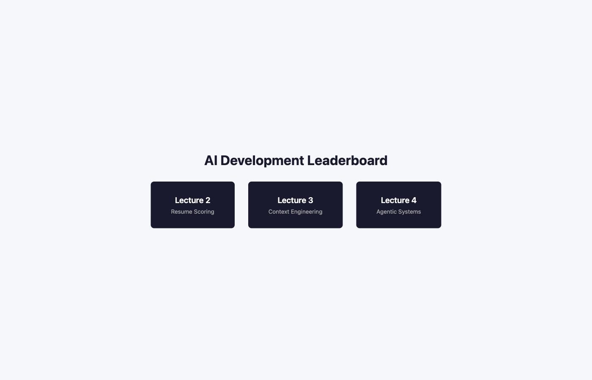
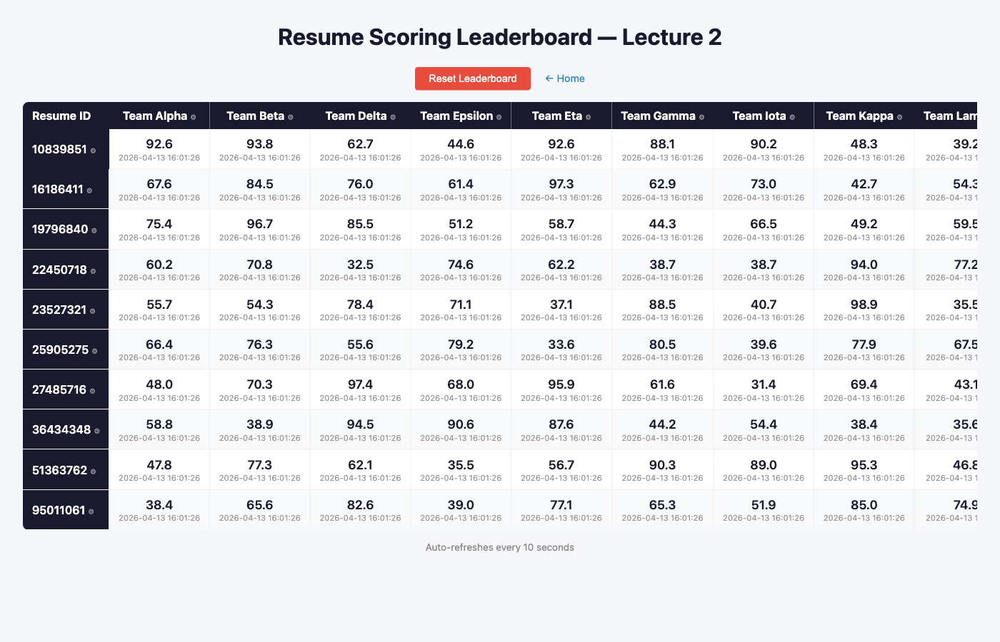
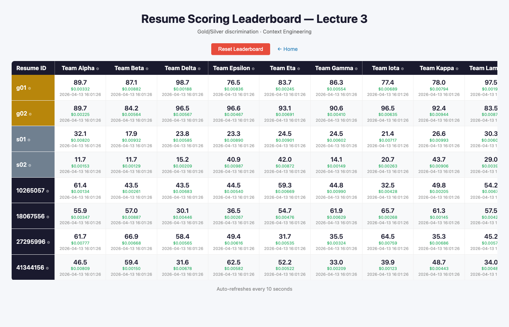
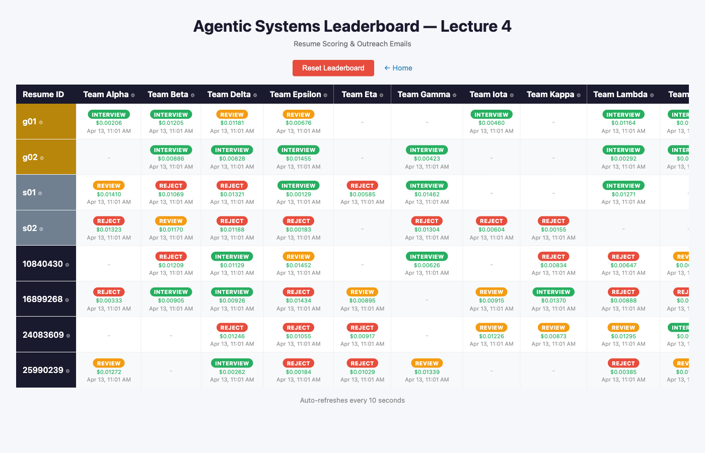

# Leaderboard

A multi-lecture leaderboard system for the AI Development course. Each leaderboard tracks student team submissions for a different assignment, with real-time scoring grids and admin controls.

## Lectures

### Lecture 2 — Resume Scoring
Students build their first LLM-powered resume scoring system. Teams submit numeric scores (0–100) for a set of real anonymized resumes, and the leaderboard displays a grid of teams vs. resume IDs. This assignment introduces prompt engineering fundamentals: students iterate on system prompts to produce consistent, calibrated scores.

### Lecture 3 — Context Engineering (Gold/Silver Discrimination)
Building on Lecture 2, students must now discriminate between "gold" (strong-fit) and "silver" (weak-fit) resumes. The leaderboard color-codes resume IDs by tier and computes per-team metrics: gold/silver mean gap, rank separation, and cost. This assignment teaches context engineering — crafting prompts and few-shot examples that produce meaningfully different outputs for different input categories.

### Lecture 4 — Agentic Systems (Outreach Emails)
Students build an agentic pipeline that reads a resume, decides an outcome (INTERVIEW / REJECT / REVIEW), and drafts a personalized outreach email. The leaderboard shows outcome badges instead of numeric scores, and each cell is clickable to view the generated email. A slideshow overlay lets instructors review all emails for a given resume across teams. This assignment covers tool use, multi-step reasoning, and structured output in agentic LLM systems.

## Screenshots

| Home | Lecture 2 | Lecture 3 | Lecture 4 |
|------|-----------|-----------|-----------|
|  |  |  |  |

## Running

```bash
# Start the server
uvicorn leaderboard.app:app --reload

# Run tests
python -m leaderboard.test_leaderboards

# Capture screenshots (seeds test data, launches Playwright)
python -m leaderboard.screenshot_leaderboards
```
